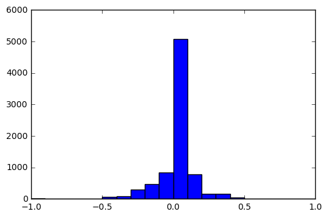
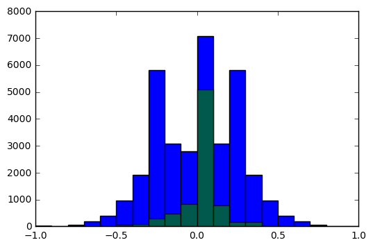

# CarND-Behavioral-Cloning

## Data Exploration

### Original Data

Used data from the first track provided from Udacity in the project description.

### Data Augmentation

1. Use right images with -0.25 adjust
1. Use left images with 0.25 adjust
1. Flip right, left and center images that has steering angles greater than 0.05

### Preprocessing Images
1. Resize from 320x160 to 80x40
1. Crop...
1. Convert image from (0, 255) to (-1, 1): centralize the input data and keep it with zero mean and small variance to help the optimizer in finding a good solution.

## Model Architecture
My deep learning model consist of four layers.
The first is a convolution layer with a 3x3 kernel, the image data as inputs (37x160x3) and an output of 16 channels.
This layer uses relu as the activation function.
This layer also uses pooling (with k=2), so the output was reduced to 18x80x16.

The second layer is the same as the first layer but has an output with 64 channels.
So the final output (after pooling) for this layer is 9x40x64.

The third is a fully connected layer, that receives the flattened second convolution layer as input and has an output of 512.
This layer uses relu as the activation function.

The forth and final layer is also a fully connected layer that receives the above layer as input and has an output of one value, representing the steering angle in respect of the input image.

Dropout with probability of 0.1 was used after each layer (except the output layer) to reduce overfitting.
The model uses a loss function with regularization to be even more strong against overfitting.

## Training Process
It's not viable for this problem to load and preprocess all data in memory to feed the network for trainig.
So a python generator function was used to provide input data in batches. 

The input data was randomly splitted to use 80% for training and 20% for validation.

The Adam optimizer was used because it's a better fit to stochastic optimizations by controlling the learning rate along each round of training.
The learning rate with the best results was 0.001.
To prevent overfitting, the model uses a loss function with regularization (beta=0.001) and dropout (probability=0.5).
The batch size is 100 and the number of epochs is 10.
However, after 5 epochs the results starts to improve very slowly but it's still relevant for the final results.

The mean squared error loss function was used in the training process.

## Results
The mean squared error achieved in the training process was 0.0200 and 0.0250 for the training and validation data, respectively.

The deep learning network described here was able to successfully drives the car through the track 1.
