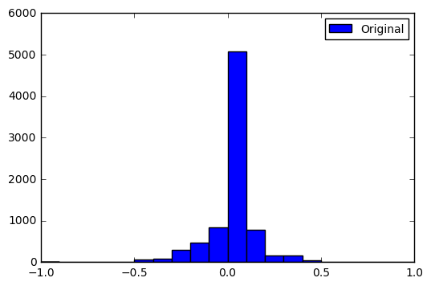
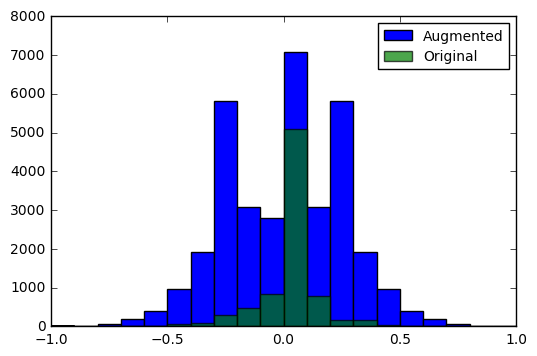

# CarND-Behavioral-Cloning

## Data Exploration

### Original Data

Use data from the first track provided from Udacity in the project description.

### Data Augmentation

1. Use right images with -0.25 adjust
1. Use left images with 0.25 adjust
1. Flip right, left and center images that has steering angles greater than 0.05

### Preprocessing Images
1. Resize from 320x160 to 80x40
1. Crop ...
1. Normalize from [0, 255] to [-1, 1]

## Model Architecture

## Training Process

## Results