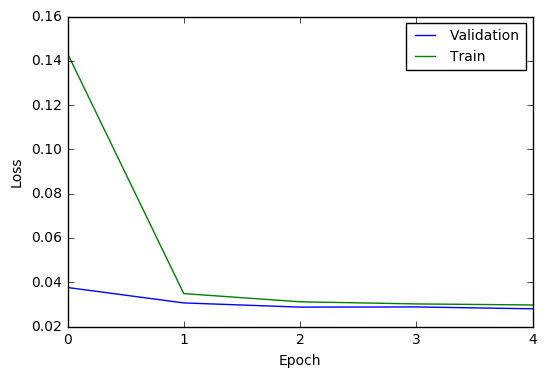

# CarND-Behavioral-Cloning

Source code for the Behavioral Cloning project from Udacity's Self Driving Car Nanodegree.

## Data Exploration

The data used in this project was provided from Udacity in the project description.
This data contains 8036 samples on driving in the first track from simulator.
Each row contains three images from left, center and right cameras and a steering angle (other input parameters are not used here).

See below an example of left, center and right images:

This data is highly unbalanced, as you may see below:

### Data Augmentation
An data augmentation process was used to have a better balance of data.
It consist of three steps:

1. Use right images and adjust the steering angle with a constant of -0.25.
1. Use left images and adjust the steering angle with a constant of 0.25.
1. Flip right, left and center images that has steering angles greater than 0.01.

After that, the augmented data had a much better balance:

### Preprocessing Images
1. Resize the input image from 320x160 to 80x40.
1. Crop image vertically, removing the first 15 and the last 7 pixels, resulting in a 80x18 image.
1. Convert color space from BGR to HSV to offer an advantage to the model in using a color space that has a separated brightness (value) component.
1. Convert image from (0, 255) to (-1, 1) to centralize the input data and keep it with zero mean and small variance to help the optimizer in finding a good solution.

## Model Architecture
The deep learning model designed for this project consist of five layers.

The first is a convolution layer with a 3x3 kernel, the image data as inputs (18x80x3) and an output of 16 channels.
This layer uses ReLU as the activation function.
This layer also uses max pooling (with k=2), so the output was reduced to 9x40x16.

The second layer is similar to the first layer but has an output of 64 channels.
So the final output (after pooling) for this layer is 4x20x64.

The third is a fully connected layer, that receives the flattened second convolution layer as input and has an output of 256.
This layer uses ReLU as the activation function.

The forth layer is similar to the third but has an output of 50.

The fifth and final layer is also a fully connected layer, that receives the above layer as input and has an output of one value, representing the steering angle in respect of the input image.

Dropout with probability of 0.2 was used after each layer (except the output layer) to reduce overfitting.
The model uses a loss function with regularization to be even more strong against overfitting.
This regularization parameter was useful in reducing oscillation and to get a more stable driving.

## Training Process
It's not feasible for this problem to load and preprocess all data in memory to feed the network for training.
So, a python generator function was used to provide input data in batches. 

The input data was randomly selected to use 80% for training and 20% for validation.

The Adam optimizer was used because it's a better fit to stochastic optimizations by controlling the learning rate along each round of training.

To prevent overfitting, the model uses a loss function with regularization (beta=0.002) and dropout (probability=0.2).
The batch size is 100 and the number of epochs is 5.
However, after 3 epochs the results starts to improve very slowly and does not seems to be relevant for the final results.

The loss function used in the optimization process was *mean squared error*.

## Results
The mean squared error achieved in the training process was 0.0297 and 0.0280 for the training and validation data, respectively.

The deep learning network described here was able to successfully drive the car through the track 1: [one lap example](track1.ogv?raw=true).

See below some predictions made by the model described here:

